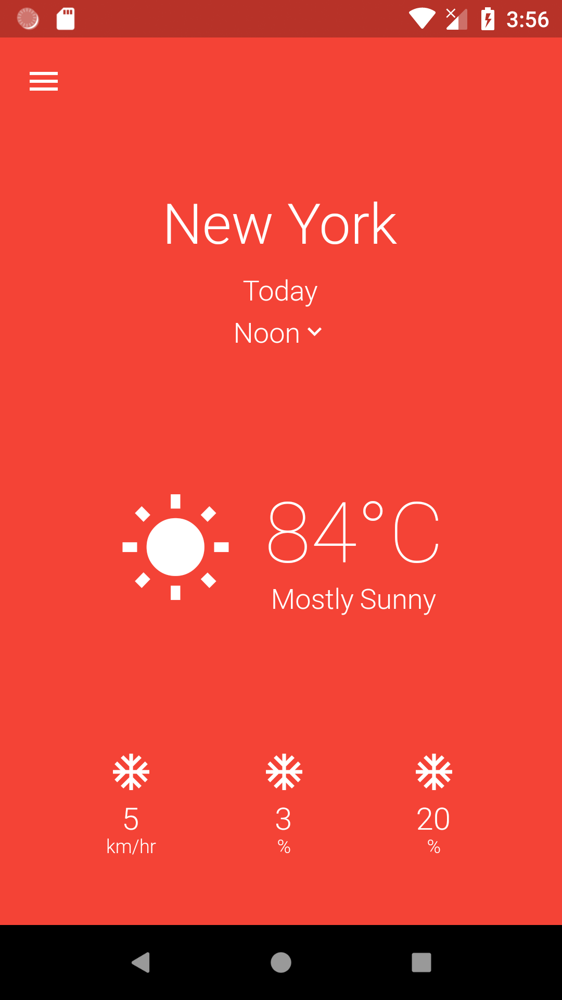

# WeatherHome-App
It's a static weather app build in Flutter to get the hang of basic widgets, specially rows and columns.
I learned to build this app in Flutter Study Jam - BBSR. In this, we recreated the design by [Parth Jansari](https://www.uplabs.com/posts/weather-app-concept-a322a6f7-45b6-47f7-9996-9202be33c161).

## Screnshot of the app
 
